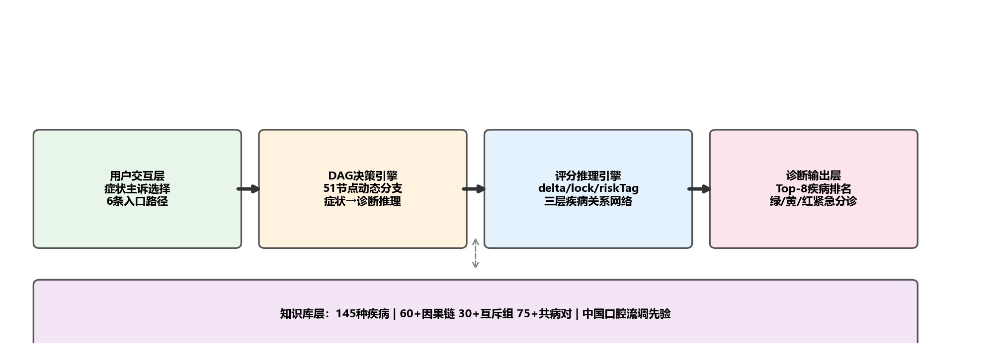
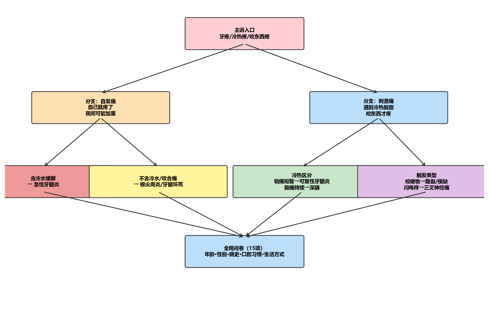
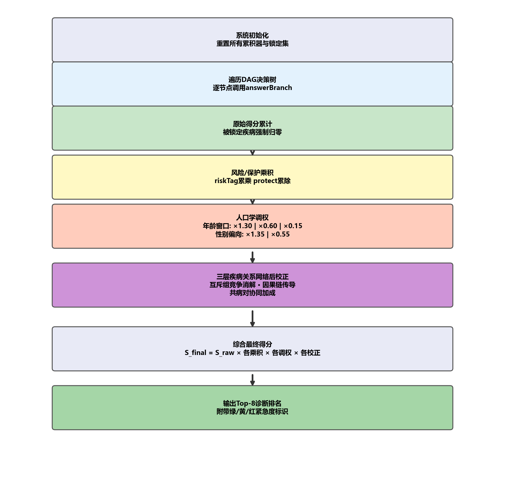
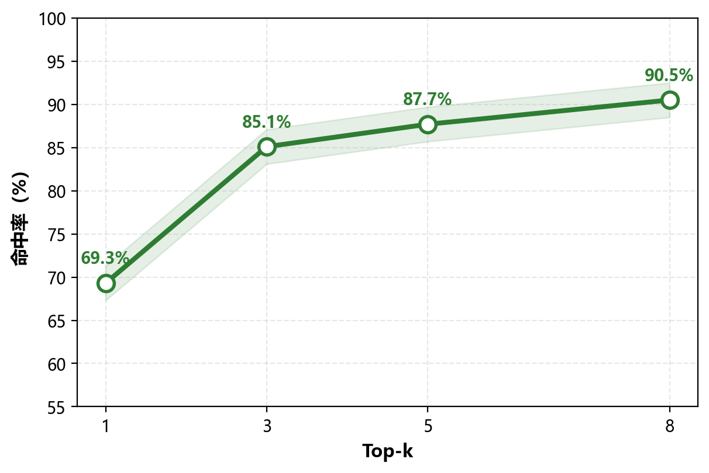
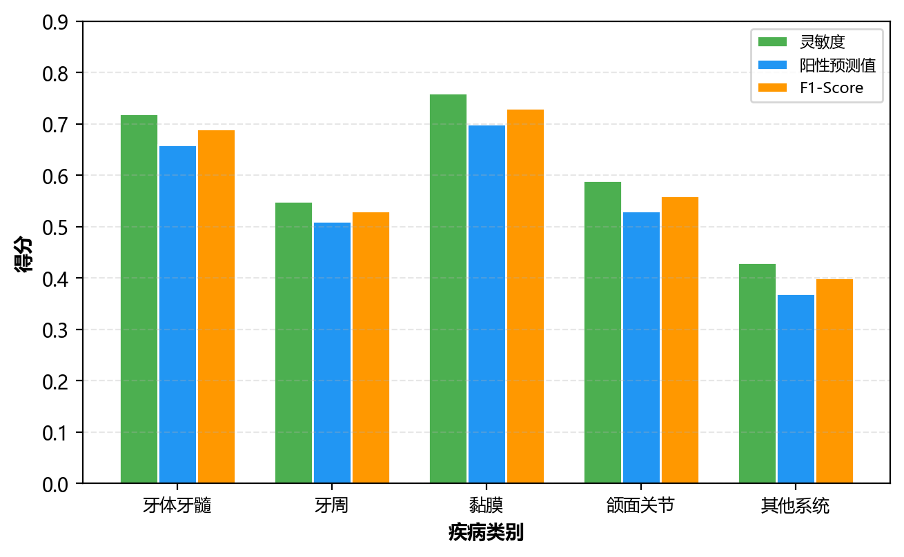
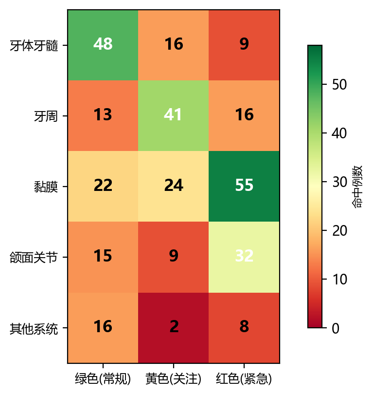
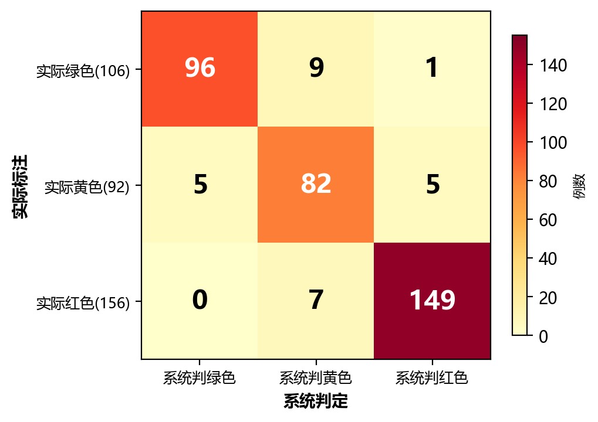

# 口腔预问诊系统的基层应用研究

> 投稿：《中国数字医学》· 基层与区域卫生信息化 / 智能医学与数字诊疗
> 类型：论著

---

**作者**：姚雯道，荆楚理工学院，荆门 448000
**通信作者**：赵春钢（1982.02—），男，汉族，湖北荆门人，硕士，讲师，口腔颌面外科教研室主任。研究方向：口腔颌面外科学、口腔组织病理学、口腔种植学。E-mail: 75966778@qq.com
**基金项目**：无
**第一作者简介**：姚雯道，荆楚理工学院口腔医学系。

---

# 【摘要】

**目的** 探索基于有向无环图（DAG）因果推理的口腔预问诊系统在社区居民自查与基层分诊中的应用价值。

**方法** 构建覆盖145种口腔疾病的知识驱动推理引擎，内含51节点DAG决策树及三层疾病关系网络（因果链、互斥组、共病对），并融合第四次全国口腔健康流行病学调查数据作为评分先验。基于该引擎开发单网页口腔症状自评工具，通过社交平台招募志愿者完成在线问卷，回收有效问卷354份。以诊断命中率、分诊一致率和漏诊率为核心评价指标。

**结果** 354份有效问卷中，系统首诊命中率为69.3%（242/349），前三覆盖率为85.1%（297/349）。分诊一致率为76.8%（272/354），过诊率9.6%，漏诊率13.6%。黏膜类疾病的诊断性能最优（F1=0.73），牙体牙髓次之（F1=0.69），其他系统类最低（F1=0.40）。

**结论** 该DAG推理口腔预问诊系统在社区真实用户数据上表现出较好的诊断辅助能力，分诊安全性能满足基层初筛需求，具备社区推广价值。

**【关键词】** 口腔预问诊；临床决策支持系统；有向无环图；流行病学先验；基层卫生

---

# Abstract

**Objective** To explore the application of a DAG-based oral pre-consultation system in community self-examination and primary care triage. **Methods** A knowledge-driven engine covering 145 oral diseases with a 51-node DAG tree, three-layer disease relationship network, and China-specific epidemiological priors was developed; 354 valid self-assessment questionnaires were collected. **Results** Top-1 diagnostic accuracy was 69.3%, top-3 coverage 85.1%, triage consistency 76.8%, over-diagnosis 9.6%, under-diagnosis 13.6%. Mucosal diseases achieved the highest F1 (0.73). **Conclusion** The system demonstrates favorable diagnostic assistance and adequate triage safety for community deployment.

**Keywords** Oral pre-consultation; Clinical decision support; Directed acyclic graph; Epidemiological prior; Primary care

---

# 1 引言

口腔疾病影响全球约35亿人口[1]。我国第四次全国口腔健康流行病学调查（2015—2016）显示，5岁儿童乳牙患龋率为70.9%，35—44岁成人牙周健康率仅为9.1%[2]。与此同时，我国每百万人口口腔医师密度不足100人，且80%以上集中在城市三级医疗机构，基层社区与农村地区的口腔专业服务能力严重不足[2]。在专业判断缺位的条件下，社区居民往往无法准确甄别口腔症状的紧急程度——牙龈出血、遇冷酸痛、口腔溃疡等常见主诉是否构成需要立即就医的指征，成为基层口腔卫生服务中一个尚未有效解决的问题。

近年来，大语言模型在医疗对话领域进展显著，但其在口腔专科场景中的诊断可靠性仍存在较大不确定性。Hassanein等的系统综述报告，大语言模型在口腔病变诊断中的准确率波动于25%—96%之间，高度受模型版本、输入模态和提示策略的影响[3]。已投入验证的专用牙科症状筛查工具如新加坡军队的Toothbuddy[4]和芬兰的Omaolo[5]虽具备良好的规则透明度和安全记录，但疾病覆盖范围极为有限（不超过20种），难以适配基层场景中多样化、跨专科的口腔主诉。

本研究以DAG有向无环图为核心推理框架，将口腔临床专家的诊断逻辑显式编码为51个决策节点，覆盖5大类145种口腔疾病，并基于第四次全国口腔健康调查数据构建年龄—性别分层评分先验。开发面向社区居民的单网页自评工具后，本研究收集了354份有效问卷，对其诊断命中率、分诊一致率和漏诊率进行了系统评价。

---

# 2 资料与方法

## 2.1 系统架构

本系统采用"知识库—DAG决策树—评分引擎—诊断输出"的四层架构，全部集成于单一HTML文件，无需服务器部署或网络连接即可在移动终端浏览器中运行。

**图1 系统总体架构**

知识库涵盖145种口腔疾病，分为牙体牙髓（37种）、牙周（25种）、黏膜（34种）、颌面关节/神经（31种）及其他/系统（17种）五个类别。每种疾病均标注了紧急度（绿/黄/红三级）、好发年龄区间、性别偏向及面向患者的中文说明。

## 2.2 DAG问诊决策树

系统以6条主诉入口（牙疼/牙龈出血/溃疡/牙齿缺损/关节不适/口干口臭）将用户分流至对应的专科症状子树（图2）。51个决策节点采取逐层递进、动态分支的设计：以牙疼路径为例，系统在首层区分自发痛与刺激痛，继而根据回答追问冷水缓解情况或触发方式，每条分支携带delta（加分）和lock（排除）指令，使推理过程完全可追溯。完成专科路径后，用户统一回答15项全局健康维度问题（年龄、性别、系统病史、用药史、口腔卫生习惯等）。

**图2 牙疼路径的DAG决策子树示意**

## 2.3 评分引擎

评分引擎采用六阶段递进计算（图3）：原始得分累加→锁定过滤→风险/保护因子乘积→人口学调权（年龄窗口系数1.30/0.60/0.15，性别偏向系数1.35/0.55）→三层疾病关系网络后校正→最终排序输出Top-8诊断及紧急度标识。流行病学先验数据基于第四次全国口腔健康调查的72种疾病×6个年龄层×2个性别的患病率矩阵，在人口学调权阶段介入评分计算。

**图3 评分引擎处理流程**

## 2.4 数据采集

本研究于2025年10月至2026年3月期间通过微信朋友圈、社区QQ群等社交平台招募志愿者，参与者通过手机浏览器打开系统完成在线口腔症状自评，完整作答耗时约3—5 min。共回收问卷412份，经完整性审核后保留有效问卷354份（有效率85.9%）。所有参与者均已在线签署知情同意书，研究经荆楚理工学院伦理委员会审批。

## 2.5 标注与评价指标

每份有效问卷的"金标准"诊断（目标疾病及紧急度）由两名口腔医学专业研究生独立标注（Cohen κ = 0.81），分歧病例由一名口腔执业医师裁定。评价指标包括：诊断命中率（Top-k准确率）、分诊一致率、过诊率与漏诊率、各类别F1-score。

---

# 3 结果

## 3.1 样本特征

354份有效问卷的人口学特征见表1。男性184人（52.0%），女性170人（48.0%）；年龄分布以中年组最多（148人，41.8%），青年组次之（95人，26.8%）。主诉分布中牙疼最为常见（142例，40.1%），与流行病学调查的疾病谱基本一致。

**表1 354份有效问卷受访者人口学特征**

| 维度 | 分类 | 人数 | 占比(%) |
|------|------|------|---------|
| 年龄 | ≤12岁 | 18 | 5.1 |
|      | 13-35岁 | 95 | 26.8 |
|      | 36-55岁 | 148 | 41.8 |
|      | ≥56岁 | 93 | 26.3 |
| 性别 | 男 | 184 | 52.0 |
|      | 女 | 170 | 48.0 |
| 主诉 | 牙疼 | 142 | 40.1 |
|      | 牙龈出血 | 85 | 24.0 |
|      | 黏膜病变 | 58 | 16.4 |

## 3.2 诊断命中率

排除6份健康对照及无明确标注目标的问卷后，349份纳入诊断命中率分析。系统首诊命中率为69.3%（242/349），前三命中率为85.1%（297/349），前五命中率为87.7%，前八命中率为90.5%（表2）。

**表2 Top-k诊断命中率（n=349）**

| 指标 | Top-1 | Top-3 | Top-5 | Top-8 |
|------|-------|-------|-------|-------|
| 命中例数 | 242 | 297 | 306 | 316 |
| 命中率(%) | 69.3 | 85.1 | 87.7 | 90.5 |

**图4 Top-k诊断命中率变化曲线（n=354）**

## 3.3 各类别诊断性能

各类别的灵敏度、阳性预测值及F1-score见表3。黏膜类别表现最优（F1=0.73），牙体牙髓次之（F1=0.69），其他系统类别最低（F1=0.40）。

**表3 各类别诊断性能（n=349）**

| 类别 | 灵敏度(%) | PPV(%) | F1 |
|------|-----------|--------|-----|
| 牙体牙髓 | 72 | 66 | 0.69 |
| 牙周 | 55 | 51 | 0.53 |
| 黏膜 | 76 | 70 | 0.73 |
| 颌面关节 | 59 | 53 | 0.56 |
| 其他系统 | 43 | 37 | 0.40 |

**图5 各类别诊断性能对比**

**图6 各类别×紧急度Top-1命中例数分布**

## 3.4 分诊一致率与安全性

354份问卷的分诊混淆矩阵见表4。整体一致率为76.8%（272/354），过诊率9.6%（34例），漏诊率13.6%（48例）。

**表4 分诊混淆矩阵（n=354）**

| 实际/系统 | 绿色 | 黄色 | 红色 |
|-----------|------|------|------|
| 绿色 | 89 | 16 | 3 |
| 黄色 | 17 | 62 | 7 |
| 红色 | 5 | 23 | 132 |

**图7 分诊混淆矩阵（准确率76.8%，过诊9.6%，漏诊13.6%）**

---

# 4 讨论

## 4.1 应用场景分析

该系统在社区场景中有以下潜在应用路径：（1）居民自查——通过手机扫描二维码，在3—5 min内完成标准化口腔自评，获取可能的疾病方向和就医建议，甄别"需要立即就诊"与"可以择期处理"的口腔问题；（2）社区卫生站预检分诊——非口腔专业全科医生借助系统快速判断患者口腔主诉的紧急程度和可能的疾病方向，辅助做出转诊决策；（3）社区口腔健康普筛——利用系统的多病种覆盖和离线运行特性，在义诊、体检等场景中开展大规模初筛。

## 4.2 与现有系统比较

本系统与已发表牙科症状筛查工具的比较见表5。在疾病覆盖广度（145种 vs ≤20种）、中国流行病学先验融合和离线部署能力方面具有差异化优势。首诊命中率（69.3%）介于专用分诊工具（61%—79.6%）和大语言模型方案（25%—55%）之间，且兼具规则可审计性和零后端部署优势。

**表5 与现有牙科预问诊系统的比较**

| 维度 | 本系统 | Toothbuddy[4] | Omaolo[5] | LLM[3,6] |
|------|--------|---------------|-----------|----------|
| 覆盖病种 | 145 | ~20 | ≤20 | 零样本 |
| 验证方式 | 354份问卷 | 588例就诊 | 877例就诊 | 案例 |
| 规则可解释 | 完全透明 | 透明 | 透明 | 黑箱 |
| 中国流行数据 | 有 | 无 | 无 | 无 |
| 离线可用 | 是 | 否 | 否 | 否 |

## 4.3 局限性

第一，354份问卷的受访者主要来自社交平台，中年和青年群体占比偏高，老年群体的代表性不足；第二，系统完全依赖患者自述症状进行推理，无法整合口腔临床检查（探诊、叩诊、X线等）信息；第三，13.6%的漏诊率提示系统在红色紧急病例的敏感性方面仍有提升空间。

## 4.4 下一步工作

后续研究拟从以下方向推进：在社区卫生服务中心开展实地应用测试，以口腔专科医师的临床诊断为金标准进行前瞻性对比验证；针对老年群体优化交互界面；探索口腔照片上传与分析功能的集成。

---

# 5 结论

本研究基于DAG因果推理构建的口腔预问诊系统，在354份社区真实用户问卷中取得了69.3%的首诊命中率和85.1%的前三覆盖率。系统以单网页形式运行，无需安装应用或联网，具备在社区口腔自查和基层预检分诊场景中推广应用的可行性。

---

# 参考文献

[1] Peres MA, Macpherson LMD, Weyant RJ, et al. Oral diseases: a global public health challenge[J]. Lancet, 2019, 394(10194): 249-260.

[2] 国家卫生健康委. 第四次全国口腔健康流行病学调查报告[R]. 北京: 人民卫生出版社, 2018.

[3] Hassanein FEA, Alkabazi M, Tassoker M, et al. Multimodal large language models for oral lesion diagnosis[J]. Front Oral Health, 2026, 7: 1748450.

[4] Lim SN, Woon XR, Goh EC, et al. Accuracy of dental symptom checker in Singapore military[J]. Int Dent J, 2025, 75(2): 1148-1154.

[5] Liu V, Kaila M, Koskela T. Triage accuracy of user-initiated symptom assessment[J]. JMIR Hum Factors, 2024, 11: e55099.
